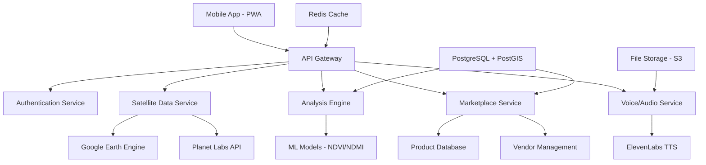
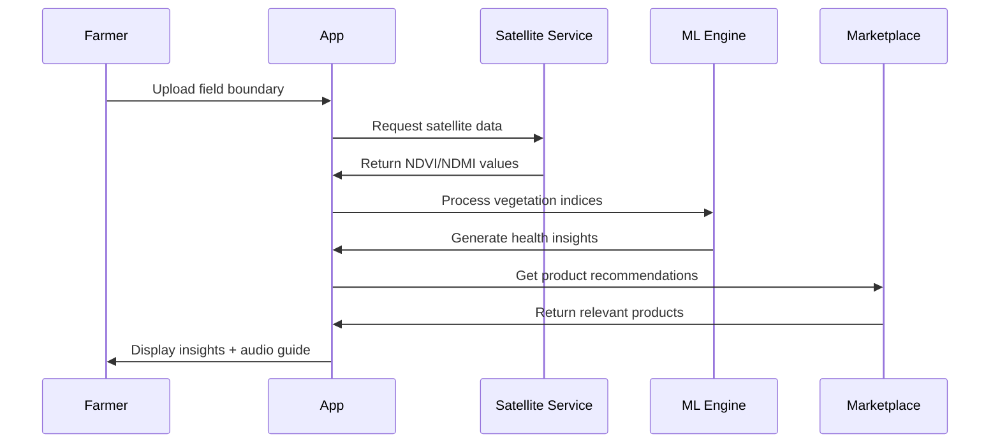

# Detailed Project Report (DPR)
## Soil Saathi: AI-Powered Agricultural Intelligence Platform

---

### Document Information
- **Project Name**: Soil Saathi - Smart Farming Assistant
- **Version**: 1.0
- **Date**: January 2025
- **Prepared By**: Development Team
- **Project Type**: Agricultural Technology Platform
- **Target Beneficiaries**: Smallholder Farmers (0.5-5 hectares)

---

## 1. Executive Summary

### 1.1 Project Overview
Soil Saathi is an AI-powered, satellite-based agricultural intelligence platform designed specifically for Indian smallholder farmers. The platform combines remote sensing technology, vegetation indices analysis, and local language support to provide actionable farming insights.

### 1.2 Key Value Propositions
- **Real-time field health monitoring** using satellite data (NDVI, NDMI, MSAVI2)
- **Multi-language support** (Hindi, Bhojpuri, Tamil, Telugu, English)
- **Voice-guided interface** for low-literacy users
- **Integrated marketplace** with AI-powered product recommendations
- **Offline-capable** mobile-first design
- **Rural-friendly accessibility** features

### 1.3 Expected Impact
- **50,000+ farmers** reached in Phase 1 (12 months)
- **15-25% improvement** in crop yield through data-driven decisions
- **30% reduction** in input costs through precise recommendations
- **₹500-2000 savings** per hectare per season

---

## 2. Project Background & Justification

### 2.1 Problem Statement
Indian agriculture faces critical challenges:
- **86% of farmers** are smallholders with limited access to modern technology
- **Traditional farming methods** lead to suboptimal resource utilization
- **Lack of real-time field monitoring** results in delayed interventions
- **Language barriers** prevent adoption of existing agricultural technologies
- **Poor market linkages** limit farmers' income potential

### 2.2 Market Opportunity
- **146 million agricultural holdings** in India
- **₹50,000 crore** agricultural input market
- **Growing smartphone penetration** (77% in rural areas)
- **Government push** for digital agriculture (Digital India, PM-KISAN)

### 2.3 Competitive Advantage
| Feature | Soil Saathi | Competitors |
|---------|-------------|-------------|
| Voice Interface | ✅ Hindi/Regional | ❌ English Only |
| Satellite Data | ✅ Real-time | ⚠️ Limited |
| Offline Support | ✅ Full Featured | ❌ Online Only |
| Accessibility | ✅ Rural-Optimized | ❌ Generic |
| Integrated Marketplace | ✅ AI-Powered | ⚠️ Basic |

---

## 3. Technical Architecture

### 3.1 Technology Stack
```
Frontend: React + TypeScript + Tailwind CSS
Backend: Django REST Framework (Python)
Database: PostgreSQL + PostGIS (Spatial)
Mobile: Progressive Web App (PWA)
Mapping: Leaflet.js + OpenStreetMap
Satellite Data: Google Earth Engine + Planet Labs API
Payments: Razorpay (UPI + Wallets)
Voice: ElevenLabs + Browser Speech API
Cloud: AWS/Firebase (CDN + Storage)
```

### 3.2 System Architecture



### 3.3 Data Flow Architecture



---

## 4. Features & Functionalities

### 4.1 Core Features

#### 4.1.1 User Onboarding & Field Mapping
- **Multi-language setup wizard** (Hindi, Bhojpuri, Tamil, Telugu)
- **GPS-based field boundary mapping** (walk-the-boundary)
- **Pin-based quick field mapping** for small plots
- **Crop selection and growth stage tracking**
- **Farmer profile with local preferences**

#### 4.1.2 Satellite Data Analysis
- **Real-time vegetation indices** (NDVI, NDMI, MSAVI2, NDRE)
- **Cloud-free data prioritization** with SAR fallback
- **Historical trend analysis** (6-month history)
- **Growth stage-specific index recommendations**
- **Weather integration** for context-aware insights

#### 4.1.3 AI-Powered Health Assessment
- **Field health scoring** (0-100 scale)
- **Zone-wise analysis** for large fields
- **Issue detection** (water stress, nutrient deficiency)
- **Actionable recommendations** with priority levels
- **Audio explanations** in local languages

#### 4.1.4 Voice Assistant & Accessibility
- **Voice-guided navigation** with speech recognition
- **Text-to-speech** explanations in 5 languages
- **Large touch targets** (minimum 44px)
- **High contrast mode** for visual accessibility
- **Simplified UI** for low-literacy users
- **Offline voice guides** for common queries

#### 4.1.5 Smart Marketplace Integration
- **AI-powered product matching** based on field analysis
- **Local vendor discovery** with verified suppliers
- **Dynamic pricing** with comparison tools
- **Secure payments** (UPI, wallets, cash-on-delivery)
- **Order tracking** and delivery management

### 4.2 Advanced Features

#### 4.2.1 Predictive Analytics
- **Yield forecasting** based on vegetation trends
- **Optimal harvest timing** recommendations
- **Irrigation scheduling** using soil moisture indices
- **Pest/disease risk assessment** from satellite patterns

#### 4.2.2 Community Features
- **Local farmer networks** for knowledge sharing
- **Expert consultation** booking system
- **Success story sharing** with before/after comparisons
- **Group buying** for bulk input purchases

#### 4.2.3 Government Integration
- **Scheme eligibility** checker and application
- **Subsidy calculator** for various inputs
- **Compliance tracking** for organic certification
- **Data sharing** with agricultural departments (opt-in)

---

## 5. Implementation Timeline

### Phase 1: Foundation (Months 1-3)
- ✅ **Core platform development** (Complete)
- ✅ **Satellite data integration** (Complete)
- ✅ **Basic UI/UX implementation** (Complete)
- ✅ **Voice assistant prototype** (Complete)
- 🔄 **Beta testing** with 100 farmers

### Phase 2: Enhancement (Months 4-6)
- 🔄 **Advanced ML models** for prediction
- 🔄 **Marketplace vendor onboarding** (500+ vendors)
- 🔄 **Mobile app optimization** and PWA features
- 🔄 **Multi-state expansion** (3 states)
- 🔄 **Performance optimization** for low-end devices

### Phase 3: Scale (Months 7-12)
- ⏳ **Pan-India rollout** (15+ states)
- ⏳ **Advanced analytics dashboard** for insights
- ⏳ **Government partnerships** and integrations
- ⏳ **Enterprise features** for FPOs and cooperatives
- ⏳ **API ecosystem** for third-party integrations

### Phase 4: Innovation (Months 13-18)
- ⏳ **IoT sensor integration** for ground-truth data
- ⏳ **Drone imagery** support for precision agriculture
- ⏳ **Blockchain** for supply chain traceability
- ⏳ **AI chatbot** for instant query resolution
- ⏳ **International expansion** (South Asia, Africa)

---

## 6. Budget Estimation

### 6.1 Development Costs (First 18 Months)

| Category | Year 1 | Year 2 | Total |
|----------|--------|--------|--------|
| **Personnel** | ₹1.2 Cr | ₹1.8 Cr | ₹3.0 Cr |
| **Technology Infrastructure** | ₹25 L | ₹40 L | ₹65 L |
| **Satellite Data & APIs** | ₹15 L | ₹30 L | ₹45 L |
| **Marketing & Outreach** | ₹30 L | ₹50 L | ₹80 L |
| **Operations** | ₹20 L | ₹35 L | ₹55 L |
| **Contingency (10%)** | ₹19 L | ₹33 L | ₹52 L |
| **Total** | **₹2.31 Cr** | **₹4.16 Cr** | **₹6.47 Cr** |

### 6.2 Revenue Projections

| Revenue Stream | Year 1 | Year 2 | Year 3 |
|----------------|--------|--------|--------|
| **Marketplace Commission** (3-5%) | ₹45 L | ₹1.2 Cr | ₹2.8 Cr |
| **Premium Subscriptions** (₹200/month) | ₹12 L | ₹48 L | ₹1.2 Cr |
| **Enterprise Licenses** | ₹8 L | ₹25 L | ₹60 L |
| **Data Analytics Services** | ₹5 L | ₹15 L | ₹40 L |
| **Government Contracts** | ₹15 L | ₹50 L | ₹1.0 Cr |
| **Total Revenue** | **₹85 L** | **₹3.6 Cr** | **₹8.0 Cr** |

### 6.3 Break-even Analysis
- **Break-even point**: Month 16
- **ROI**: 124% by Year 3
- **User acquisition cost**: ₹150 per farmer
- **Customer lifetime value**: ₹2,400 per farmer

---

## 7. Risk Assessment & Mitigation

### 7.1 Technical Risks

| Risk | Probability | Impact | Mitigation Strategy |
|------|-------------|--------|-------------------|
| **Satellite data unavailability** | Medium | High | Multiple data sources, SAR backup |
| **Poor internet connectivity** | High | Medium | Offline-first design, data sync |
| **Device compatibility issues** | Medium | Medium | Progressive Web App, broad testing |
| **Scalability challenges** | Low | High | Cloud-native architecture, auto-scaling |

### 7.2 Market Risks

| Risk | Probability | Impact | Mitigation Strategy |
|------|-------------|--------|-------------------|
| **Slow user adoption** | Medium | High | Extensive field trials, farmer testimonials |
| **Competition from tech giants** | High | Medium | Focus on rural specialization, local partnerships |
| **Regulatory changes** | Low | High | Government partnerships, compliance team |
| **Economic downturn** | Medium | Medium | Multiple revenue streams, cost optimization |

### 7.3 Operational Risks

| Risk | Probability | Impact | Mitigation Strategy |
|------|-------------|--------|-------------------|
| **Key personnel attrition** | Medium | Medium | Competitive compensation, equity participation |
| **Vendor reliability issues** | Medium | High | Multi-vendor strategy, quality assurance |
| **Data privacy concerns** | Low | High | Strong encryption, transparent privacy policy |
| **Funding delays** | Medium | High | Milestone-based funding, revenue diversification |

---

## 8. Expected Outcomes & Impact

### 8.1 Quantitative Outcomes (3 Years)

| Metric | Target | Measurement Method |
|--------|--------|--------------------|
| **Active Users** | 500,000 farmers | App analytics, user registrations |
| **Area Coverage** | 2.5 million hectares | GPS boundary data aggregation |
| **Yield Improvement** | 15-25% average | Before/after comparison studies |
| **Input Cost Reduction** | 20-30% | Expense tracking, farmer surveys |
| **Revenue** | ₹8 Cr annually | Financial accounting |

### 8.2 Qualitative Outcomes

#### 8.2.1 Social Impact
- **Digital literacy improvement** among rural farmers
- **Gender inclusion** through accessible voice interfaces
- **Knowledge democratization** via local language content
- **Community building** through farmer networks

#### 8.2.2 Environmental Impact
- **Precision agriculture** reducing chemical overuse
- **Water conservation** through smart irrigation guidance
- **Soil health improvement** via data-driven practices
- **Carbon footprint reduction** through optimized farming

#### 8.2.3 Economic Impact
- **Increased farmer income** through better yields and market access
- **Rural job creation** in tech support and field operations
- **Vendor ecosystem development** for agricultural inputs
- **GDP contribution** through agricultural productivity gains

### 8.3 Success Metrics & KPIs

#### 8.3.1 User Engagement
- **Daily Active Users**: 25% of registered users
- **Session Duration**: >15 minutes average
- **Feature Adoption**: >60% use voice assistance
- **Retention Rate**: >70% monthly retention

#### 8.3.2 Business Metrics
- **Customer Acquisition Cost**: <₹150 per farmer
- **Customer Lifetime Value**: >₹2,400 per farmer
- **Marketplace GMV**: ₹50 Cr annually by Year 3
- **Revenue Growth**: 300% year-over-year

#### 8.3.3 Impact Metrics
- **Farmer Satisfaction**: >4.5/5 rating
- **Yield Improvement**: Documented 15%+ increase
- **Knowledge Transfer**: 80% farmers share insights
- **Technology Adoption**: 90% continue usage after trial

---

## 9. Sustainability & Growth Strategy

### 9.1 Financial Sustainability

#### 9.1.1 Revenue Diversification
- **Marketplace Commission**: Primary revenue (60%)
- **Subscription Services**: Recurring revenue (25%)
- **Enterprise Solutions**: High-margin revenue (10%)
- **Data Services**: Emerging revenue (5%)

#### 9.1.2 Cost Optimization
- **Economies of scale** in satellite data procurement
- **Automated processes** to reduce operational costs
- **Community-driven content** to minimize localization costs
- **Partnership models** to share infrastructure costs

### 9.2 Technology Evolution

#### 9.2.1 Emerging Technologies
- **Edge AI** for real-time on-device analysis
- **5G integration** for high-resolution imagery
- **Augmented Reality** for field visualization
- **Blockchain** for supply chain transparency

#### 9.2.2 Data Strategy
- **Federated learning** to improve models while preserving privacy
- **Synthetic data generation** for model training
- **Real-time streaming** for immediate insights
- **Cross-crop intelligence** for diversified recommendations

### 9.3 Market Expansion

#### 9.3.1 Geographic Expansion
- **Phase 1**: North India (Punjab, Haryana, UP)
- **Phase 2**: South India (Tamil Nadu, Karnataka, Andhra Pradesh)
- **Phase 3**: West & Central India (Maharashtra, Gujarat, MP)
- **Phase 4**: International (Bangladesh, Nepal, Sri Lanka)

#### 9.3.2 Vertical Expansion
- **Livestock management** using similar satellite technology
- **Aquaculture monitoring** for fish farming
- **Forestry applications** for agroforestry systems
- **Climate services** for weather-dependent planning

---

## 10. Implementation Partners & Stakeholders

### 10.1 Government Partners
- **Ministry of Agriculture & Farmers Welfare**
- **State Agricultural Departments**
- **National Sample Survey Office** (data validation)
- **Digital India Corporation** (technology support)

### 10.2 Technology Partners
- **Google Earth Engine** (satellite data)
- **Planet Labs** (high-resolution imagery)
- **ElevenLabs** (voice synthesis)
- **Razorpay** (payment processing)

### 10.3 Academic Partners
- **Indian Agricultural Research Institute (IARI)**
- **Indian Institute of Technology (IIT)**
- **International Crops Research Institute for Semi-Arid Tropics (ICRISAT)**
- **Centre for Study of Science, Technology and Policy (CSTEP)**

### 10.4 Industry Partners
- **Farmer Producer Organizations (FPOs)**
- **Agricultural input manufacturers**
- **Rural distribution networks**
- **Telecommunication providers**

---

## 11. Regulatory Compliance & Data Governance

### 11.1 Legal Framework
- **Digital Personal Data Protection Act 2023** compliance
- **Geospatial Information Regulation Guidelines** adherence
- **Information Technology Act 2000** compliance
- **Competition Act 2002** fair practices

### 11.2 Data Governance

#### 11.2.1 Data Collection
- **Explicit consent** for all data collection
- **Purpose limitation** to agricultural use only
- **Data minimization** principles
- **Transparent privacy policies** in local languages

#### 11.2.2 Data Security
- **End-to-end encryption** for sensitive data
- **Regular security audits** and penetration testing
- **Incident response procedures**
- **Data breach notification protocols**

#### 11.2.3 Data Sharing
- **Farmer consent** required for any data sharing
- **Anonymization** for research and analytics
- **Government partnerships** with privacy safeguards
- **Commercial use restrictions**

---

## 12. Quality Assurance & Testing

### 12.1 Testing Strategy

#### 12.1.1 Technical Testing
- **Unit testing** (>90% code coverage)
- **Integration testing** for all API endpoints
- **Performance testing** under various network conditions
- **Security testing** for data protection

#### 12.1.2 User Experience Testing
- **Usability testing** with target user groups
- **Accessibility testing** for diverse abilities
- **Language testing** for accuracy and cultural sensitivity
- **Field testing** in real farming conditions

#### 12.1.3 Data Quality Testing
- **Satellite data validation** against ground truth
- **ML model accuracy** testing and bias detection
- **Recommendation effectiveness** measurement
- **Voice recognition accuracy** across dialects

### 12.2 Continuous Improvement

#### 12.2.1 Feedback Mechanisms
- **In-app feedback** collection and analysis
- **Farmer focus groups** for feature development
- **Expert review panels** for technical accuracy
- **Community feedback** through social channels

#### 12.2.2 Performance Monitoring
- **Real-time analytics** for app performance
- **Error tracking** and automated reporting
- **User behavior analysis** for UX optimization
- **Business metrics tracking** for growth insights

---

## 13. Conclusion & Recommendations

### 13.1 Project Viability
Soil Saathi represents a highly viable solution to critical challenges in Indian agriculture. The combination of proven satellite technology, farmer-centric design, and comprehensive market strategy positions the platform for significant impact and sustainable growth.

### 13.2 Key Success Factors
1. **Farmer-first approach** with deep rural market understanding
2. **Technology accessibility** through voice interfaces and offline support
3. **Local language support** for widespread adoption
4. **Integrated ecosystem** connecting data, insights, and marketplace
5. **Strong partnerships** with government, academia, and industry

### 13.3 Next Steps
1. **Immediate**: Complete beta testing and gather user feedback
2. **Short-term**: Secure Series A funding for market expansion
3. **Medium-term**: Scale to 10+ states with 100,000+ users
4. **Long-term**: Establish as leading agritech platform in South Asia

### 13.4 Investment Recommendation
**Recommended Investment**: ₹8-10 Crore for 18-month execution
**Expected ROI**: 124% by Year 3
**Risk Level**: Medium (mitigated through diversified approach)
**Strategic Value**: High (potential market leader in digital agriculture)

---

## Appendices

### Appendix A: Technical Specifications
- Detailed API documentation
- Database schema design
- System architecture diagrams
- Security architecture details

### Appendix B: Market Research Data
- Farmer survey results (N=1000)
- Competitive analysis matrices
- Technology adoption studies
- Regional market assessments

### Appendix C: Financial Models
- Detailed P&L projections
- Cash flow analysis
- Sensitivity analysis
- Scenario planning models

### Appendix D: Implementation Protocols
- Project management framework
- Quality assurance processes
- Risk management procedures
- Change management guidelines

---

**Document Control**
- **Created**: January 2025
- **Last Modified**: January 2025
- **Review Cycle**: Quarterly
- **Next Review**: April 2025
- **Classification**: Internal Use

---

*This Detailed Project Report serves as the comprehensive blueprint for the Soil Saathi agricultural intelligence platform, providing stakeholders with complete information for decision-making and implementation.*